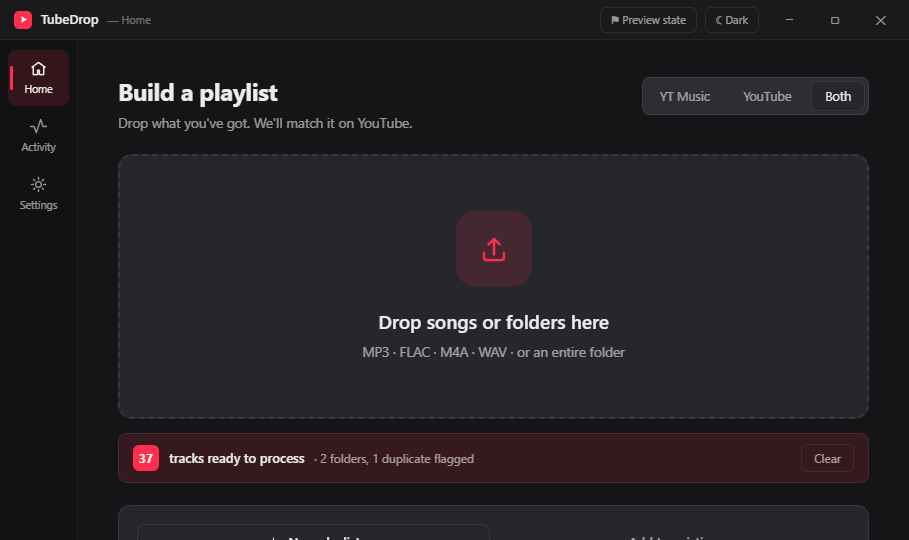

# TubeDrop

> Working title — may be renamed without architectural changes.

Drag & drop your local music, get a YouTube playlist. TubeDrop is a Windows desktop app
that reads the metadata of any audio files or folders you drop on it, matches each track
on YouTube / YouTube Music, and builds a playlist on **your own** YouTube account —
with full undo for every action.



## Features

- **Drag & drop** files and folders of any audio format (MP3, FLAC, M4A, OGG, Opus, WAV,
  WMA, AIFF, APE, MPC, WV, DSF, …); non-audio files are skipped, never an error
- **Automatic metadata** via ATL tags, with filename-heuristic fallback
  (`Artist - Title`, `NN. Title`, `NN - Artist - Title`, noise stripping)
- **In-batch dedup** on normalized artist+title within ±2 s
- **Automatic matching** with fuzzy title/artist scoring, duration checks, and
  official-source bonuses; a fallback ladder (deterministic → cloud) handles hard cases,
  including transliteration of non-Latin scripts
- **Create** a new playlist (name it after the dropped folder if you like) or **append**
  to an existing one
- **Full undo**: every mutating operation is journaled with its inverse; undo a single
  item, a selection, or a whole session
- **End-of-batch report**: added / fallback / unmatched / duplicates / skipped, filterable
  and exportable to CSV/JSON
- **Three UI skins** (Mix, Classic, Noir), switchable at runtime, dark by default
- **IT + EN**, following your OS language by default
- **Auto-update** via GitHub Releases (Velopack)

No telemetry. No API keys. No Google Cloud console.

## How sign-in works

You sign in to Google inside an embedded browser window (WebView2), exactly like in a
normal browser. TubeDrop then uses **your own session** to talk to YouTube via its
internal `youtubei` (InnerTube) endpoints — the same ones the website uses. Your login
persists between runs under `%LOCALAPPDATA%\TubeDrop\profile`.

## Install

1. Download the latest `TubeDrop-Setup.exe` from the
   [Releases](https://github.com/TX-Breaker/TubeDrop-Music-2-YT-Playlists/releases) page.
2. Run it. **SmartScreen will warn you** because the binary is not code-signed yet
   (see below) — choose **More info → Run anyway**.
3. TubeDrop installs per-user (no admin required) and updates itself from then on.

### About the SmartScreen warning

Release binaries are currently **unsigned**. Windows SmartScreen flags unknown unsigned
apps on first run; this is expected. A code-signing step is already wired into the release
pipeline as a placeholder — once a certificate is available, signed builds will stop the
warning. Until then, verify you downloaded from the official Releases page.

## Building from source

Requires the **.NET 8 SDK** on Windows 10 1903+ / Windows 11 (x64).

```powershell
dotnet build TubeDrop.sln
dotnet test
dotnet run --project src/TubeDrop.App
```

The target framework is centralized in `Directory.Build.props` for a one-line bump to
.NET 10 LTS later.

### Producing a release locally

```powershell
dotnet publish src/TubeDrop.App/TubeDrop.App.csproj -c Release -r win-x64 `
  --self-contained true -p:PublishSingleFile=true -p:Version=0.1.0 -o publish
vpk pack --packId TubeDrop --packVersion 0.1.0 --packDir publish --mainExe TubeDrop.exe
```

CI (GitHub Actions) builds and tests every PR; pushing a `vX.Y.Z` tag publishes a
single-file self-contained build, packages it with Velopack, and creates a GitHub Release.

## Project layout

```
src/TubeDrop.App         WPF UI, viewmodels, skins, services
src/TubeDrop.Core        ingestion, matching, journal, settings (no UI deps)
src/TubeDrop.InnerTube   youtubei HTTP client + parsers
tests/TubeDrop.Tests     xUnit test suite
design-reference/        the three UI skin references
```

## FAQ

**Does it download or stream music?** No. TubeDrop only builds playlists of videos that
already exist on YouTube. It never downloads or plays any media.

**Do I need a YouTube Data API key?** No. It uses your own signed-in session.

**What happens to unmatched tracks?** They go to the report, never silently guess-added.
Turn on *Aggressive mode* in Settings to add best-effort matches (still flagged).

**Can I undo a mistake?** Yes — the Activity screen lists every operation with per-item
and per-session undo. A deleted playlist is rebuilt from a snapshot (with a new id, since
YouTube has no trash).

## Disclaimer

TubeDrop is an **unofficial** client. It uses your own Google session via an embedded
sign-in, respects rate limits (~1 request / 700 ms), and does **not** download or stream
any media. Use at your own risk and in accordance with the
[YouTube Terms of Service](https://www.youtube.com/t/terms).

## License

MIT — see [LICENSE](LICENSE).

---

# TubeDrop (Italiano)

Trascina la tua musica locale, ottieni una playlist YouTube. TubeDrop è un'app desktop
per Windows: legge i metadati dei file o delle cartelle audio che trascini, trova ogni
traccia su YouTube / YouTube Music e crea una playlist sul **tuo** account YouTube —
con undo completo per ogni azione.

## Come funziona l'accesso

Accedi a Google in una finestra browser integrata (WebView2), come in un normale browser.
TubeDrop usa la **tua sessione** per comunicare con YouTube tramite gli endpoint interni
`youtubei` (InnerTube). L'accesso persiste tra gli avvii in `%LOCALAPPDATA%\TubeDrop\profile`.
Niente chiavi API, niente Google Cloud console, nessun server di terze parti.

## Installazione

Scarica l'ultimo `TubeDrop-Setup.exe` dalla pagina
[Releases](https://github.com/TX-Breaker/TubeDrop-Music-2-YT-Playlists/releases) ed eseguilo. **SmartScreen avviserà**
perché il binario non è ancora firmato: scegli **Ulteriori informazioni → Esegui comunque**.
L'installazione è per-utente (nessun admin) e gli aggiornamenti sono automatici.

## Disclaimer

TubeDrop è un client **non ufficiale**. Usa la tua sessione Google tramite accesso
integrato, rispetta i rate limit e **non** scarica né riproduce alcun contenuto.
Uso a proprio rischio e nel rispetto dei Termini di Servizio di YouTube.
